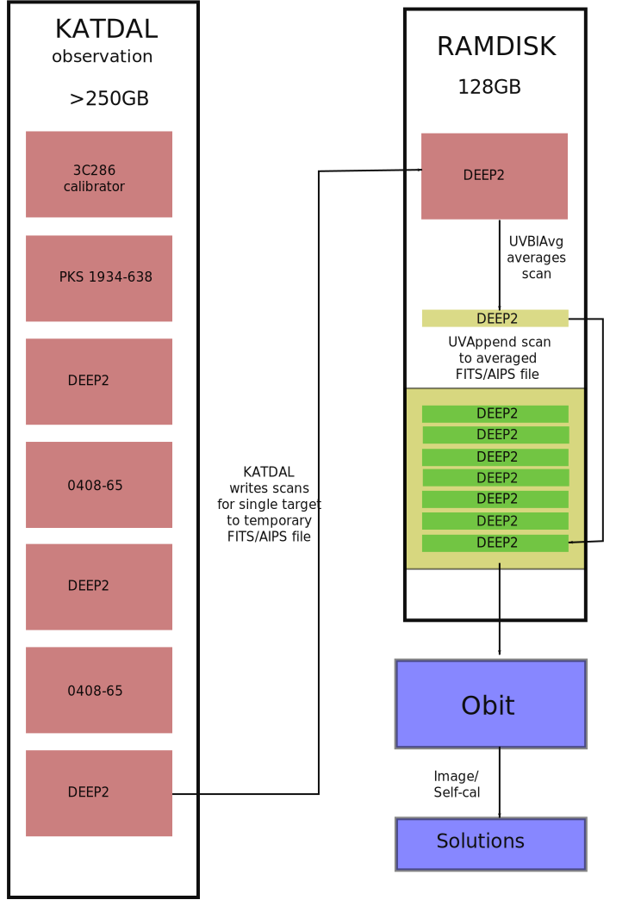

===============================================
Obit Continuum Imaging Pipeline Design Document
===============================================

In order for the Spectral Line Imager to produce images, calibration solutions must be applied to visibility data. As it stands, some calibration will already be applied to the raw L0 visibilities, producing L1 visibilities. However, this level of calibration is still insufficient for spectral line imaging.

The purpose of the Continuum Imaging Pipeline is to derive further calibration solutions for application to L1 visibilities. To achieve this:

1. A basic continuum image must be created by imaging visibilities.
2. A CLEAN style process should be applied to the resulting image to extract a sky model, iteratively convolving point sources with the Point Spread Function to remove high frequency artifacts.
3. Solve to find calibration solutions that match the visibilities with the model.
4. Apply calibration solutions to visibilities.
5. Go to (1) if a tolerance level has not been reached.

The above process can be achieved through the use of the `Obit Imager <Obit_>`_.

----------
Input Data
----------

The primary input data will be L1 visibilities, obtained from the data store,
with the following dimensions:

- 2 second time dumps. This translates to 18,000 timesteps for an 10 hour observation.
- 2016 baselines given 64 antenna (no auto-correlations)
- 4096 channels.
- 4 correlations.

Such an observation requires 4.3TB of space to represent at single precision.
In practice, averaging to 8s dumps (4500 timesteps) and 1024 channels
is viable for spectral line imaging.
Nevertheless, this would require 277GB space.

Shorter baselines are spatially clustered in the UV plane. Visibilities that
are spatially close together can be averaged via
`Baseline Dependent Averaging <UVBlAvg_>`_ with minimal loss of fidelity to
further reduce the data volume.

-----------
Output Data
-----------

The following output data will be stored in telstate.

- Calibration solutions for each target
- Sky Models for each target

-----------------------------
Available Computing Resources
-----------------------------

**TODO** Document available disk space and number of calibration nodes.

``N`` calibration nodes are available for imaging different bands.
Each node has approximately the following resources available to it:

:Memory:
    Each calibration node will have between 256GB and 512GB of RAM.

:Disk Space:
    There should be more than sufficient disk space for this task.

----
Obit
----

Obit_ is a faceted imager created by Bill Cotton of the `National Radio Astronomy Observatory <NRAO_>`_. It has already seen use in the KAT7 pipeline.

Data Format
-----------

Both visibility and image data is read and written by Obit in either AIPS or FITS format. The AIPS format requires an AIPS installation as AIPS data can only be read or written from a virtual AIPS disk.

The quantity of visibility data is large: a 10 hour DEEP2 observation can result in a 250GB uvfits file, for instance. However, the use of `Baseline Dependent Averaging <UVBlAvg_>`_, can reduce this considerably, down to ~22GB for instance, without significant effects on image fidelity. The Obit UVBlAvg_ task can additionally perform time and channel averaging mentioned `previously <Input Data_>`_.

Obit Tasks
----------

**TODO** does MFImage actually produce sky models?

Obit supplies a number of binaries for manipulating and imaging observational data
stored in AIPS/FITS.

:MFImage:
    Images visibilities. It takes visibilities as input
    and produces images, sky models and calibration solutions as output.
:UVBlAvg:
    Performs baseline dependent, as well as time and channel averaging
    on input visibilities. Outputs averaged visibilities.
:UVAppend:
    Appends multiple observations to create a single unified observation.
    A limitation of this application is that the input observations
    may only contaifn a single homogenous source. The AIPS DBCON_ application
    is more general and can concatentate multiple sources, but performs
    substantially slower.

-------------------------------
Obit Continuum Imaging Pipeline
-------------------------------

This section describes:

1. Data export to Obit
2. Obit imaging to extract calibration solutions
3. Writing calibration solutions to telstate.

    The above image illustrates the Obit Continum Imaging Pipeline.
    Individual target scans are retrieved in time order from katdal
    and written to a temporary AIPS/FITS file.
    This file is averaged and appended to an averaged AIPS/FITS file
    containing the concatenated average of all scans for that target.
    Once all scans for a target have been concatenated, the Obit
    Imager is executed on the averaged file to produce calibration solutions
    related to the target.

Data Export to Obit
-------------------

**TODO** document UVBlAvg averaging parameters.

To use Obit_, MeerKAT data must be exported to AIPS or FITS format via the KAT data access library, katdal_. Presently, this can be achieved through the use of the ``h5touvfits.py`` script, originally written for the `KAT7 Obit pipeline <KAT7-obit-pipline_>`_ to convert KAT7 HDF5_ observation files to FITS, and subsequently modified to work with MeerKAT HDF5 data.

To further reduce the data volume handled by Obit_, the UVBlAvg_ task can be subsequently
be applied to the resulting file.

In practice, writing the entire MeerKAT observation data to disk and then reading
it to average is a major I/O bottleneck.
To ameliorate this, a RAMDisk_ should be used to avoid hitting disk.

This can be achieved by subdividing and averaging the observation in the following way:

1. For each target in the MeerKAT observation data
    1. For each target scan in the MeerKAT observational data:
        1. Write the target scan to RAMDisk_ as a temporary AIPS/FITS file.
        2. Average the temporary AIPS/FITS file with the **UVBlAvg**.
    2. Append the temporary averaged files with **UVAppend** to produce
       a single, concatenated AIPS/FITS file containing all scans for the target.

The individual target scans are likely to be small, less than 10GB for example.
A 128GB RAMDisk_ should therefore provide the ability to
write, average and append multiple target scans concurrently.

This process has the additional advantage of further reducing the data volume
by avoiding writing calibrator scans to disk. They should be redundant as their
solutions have already been applied to the input L1 visibility data.

It also avoids writing code within Obit itself for accessing katdal_, avoiding
development time and maintenance.

Obit Imaging Process
--------------------

**TODO**: Define threshold for exiting self-calibration.

The previously described `data export <Data Export to Obit_>`_
produces averaged AIPS/FITS files for each target.
This file can now be input to the **MFImage** Obit task.
This task will run self-calibration on the input data until
some threshold has been reached.

Write Calibration Solutions to Telstate
---------------------------------------

The `Obit Imager <Obit Imaging Process_>`_ will produce an AIPS/FITS file
containing calibration solutions.

Obit already contains python wrappers for accessing and inspecting data in said files.
At this point, a python script will be necessary to retrieve solution data and
write it over the network to telstate.

.. _Obit: https://www.cv.nrao.edu/~bcotton/Obit.html
.. _NRAO: https://nrao.edu/
.. _DBCON: https://www.aips.nrao.edu/cgi-bin/ZXHLP2.PL?DBCON
.. _KAT7-obit-pipline: https://github.com/ska-sa/katsdppipelines/tree/master/Obit-pipeline
.. _katdal: https://github.com/ska-sa/katdal
.. _HDF5: https://www.hdfgroup.org/HDF5/
.. _UVBlAvg: ftp://ftp.cv.nrao.edu/NRAO-staff/bcotton/Obit/BLAverage.pdf
.. _RAMDisk: https://en.wikipedia.org/wiki/RAM_drive
